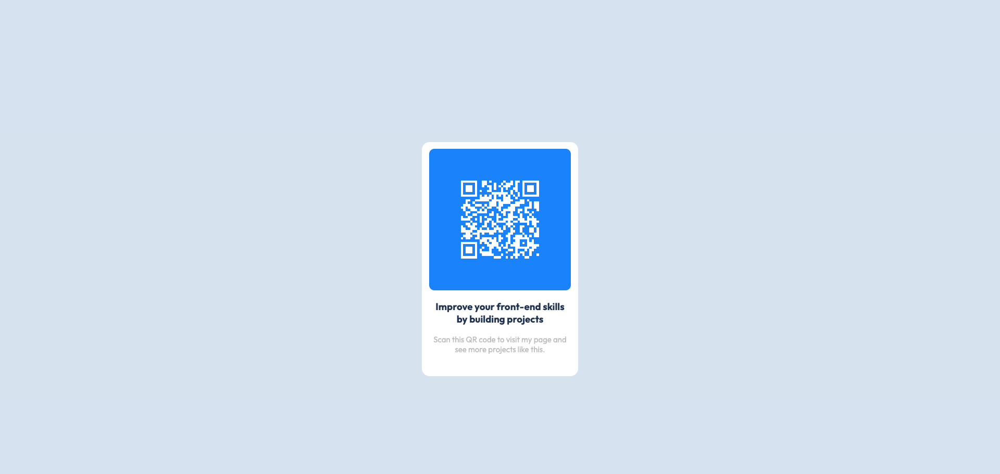

# Frontend Mentor - QR code component solution

This is a solution to the [QR code component challenge on Frontend Mentor](https://www.frontendmentor.io/challenges/qr-code-component-iux_sIO_H). Frontend Mentor challenges help you improve your coding skills by building realistic projects. 

## Table of contents

- [Overview](#overview)
  - [About the challenge](#about-the-challenge)
  - [Screenshot](#screenshot)
  - [Links](#links)
- [My process](#my-process)
  - [Built with](#built-with)
  - [What I learned](#what-i-learned)
  - [Continued development](#continued-development)
  - [Useful resources](#useful-resources)
- [Author](#author)


## Overview
## About the challenge

- Create a QR code from the design in an image.
- The code containing the this infomation [juliancarlosama.com](https://juliancarlosama.com)

### Screenshot



### Links

- Solution URL: [Solution](https://your-solution-url.com)
- Solution URL: [Vercel](https://challenges-front-end-eta.vercel.app/) 

## My process

- Qr code generated with Js for implement in news projects.

### Built with

- Semantic HTML5 markup
- CSS custom properties
- Flexbox
- Javascript
- QrJs


### What I learned

I learned to create a QR code using the Javascript QRCodeJs library and then implement in the design proposed in the challenge.

```js
const myQRCode = document.getElementById('QrCode');

const qr = new QRCode(myQRCode, 
    {
        text: 'https://juliancarlosama.com/',
        width: 150,
        height: 150,
        colorDark: '#ffffff',
        colorLight:'#077FFF',
        correctLevel : QRCode.CorrectLevel.H
    }
);
```

### Continued development

- Improve my skills in Css.
- Improve my skills in Flexbox.
- Improve my skills in Js.
- Improve my skills in React.


### Useful resources

- [How generate a QR code with Js, 'Resource in Spanish'](https://denisseestrada.com/como-generar-un-codigo-qr-con-javascript/) - This helped me for create my own QR code.


## Author

- Website - [juliancarlosama.com](https://juliancarlosama.com)
- Frontend Mentor - [@Julian-Carlosama](https://www.frontendmentor.io/profile/Julian-Carlosama)
- Twitter - [@JulianCarlosam3](https://www.twitter.com/JulianCarlosam3)

